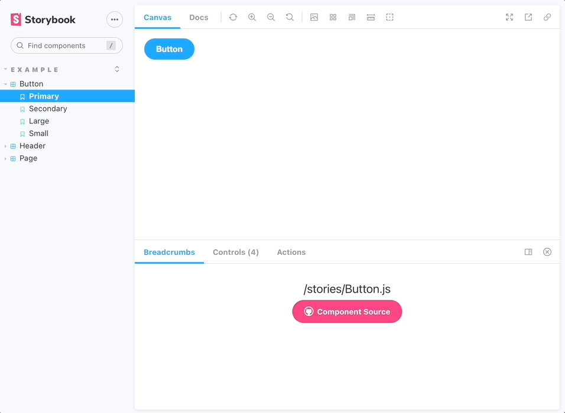

# Storybook Addon breadcrumbs

show the file breadcrumbs of your components.



Check out the deployed [demo storybook](https://shaun-lloyd-chromatic.surge.sh/)

## 🏁 Getting started

```
yarn add --dev storybook-addon-breadcrumbs
```

### ⚙️ Configuration

1. Add `"storybook-addon-breadcrumbs"` to your `.storybook/main.js` config with the following options:
   - `repositoryRoot`: The root of your repo
   - `defaultBranch`: Your repo's default branch on github. Defaults to `"main"`
   - `githubUrl`: Url to your repo on github

```js
// ./storybook/main.js
const path = require("path");

module.exports = {
  stories: [
    "../stories/**/*.stories.mdx",
    "../stories/**/*.stories.@(js|jsx|ts|tsx)",
  ],
  addons: [
    {
      name: "../preset.js",
      options: {
        breadcrumbs: {
          repositoryRoot: path.resolve(__dirname, "../"),
          defaultBranch: "main",
          githubUrl: "https://github.com/ShaunLloyd/breadcrumb-addon",
        },
      },
    },
  ],
};
```

2. Add the `"breadcrumbs"` parameter to your desired stories. This should be the path to your component relative to your story file.
   - See example in [./stories/Button.stories.js](./stories/Button.stories.js)

```js
import React from "react";
import { Button } from "./Button";

export default {
  title: "Example/Button",
  component: Button,
  parameters: {
    breadcrumb: "./Button.js",
  },
};
```

## 🧩 Compatibility

Currently this addon only works for React in Javascript. Typescript support is coming soon.

## 🤝 Contributing

- `yarn start` runs babel in watch mode and starts Storybook
- `yarn build` build and package your addon code

## 🔮 Coming soon™

- Support for `typescript` create-react-app projects
